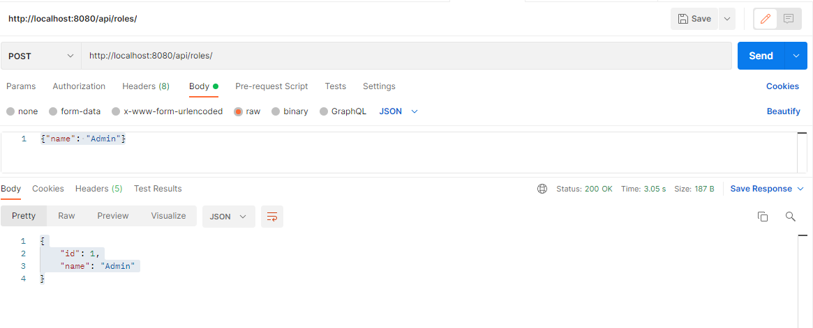
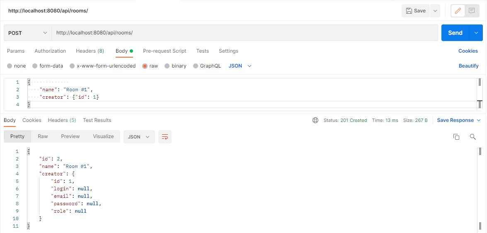
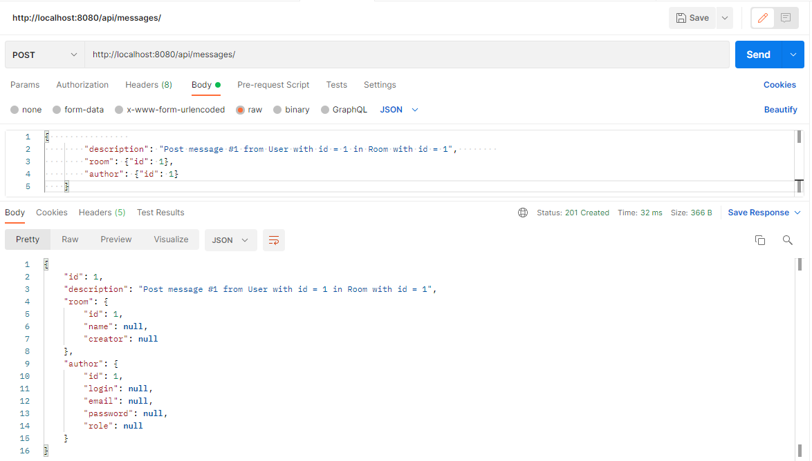
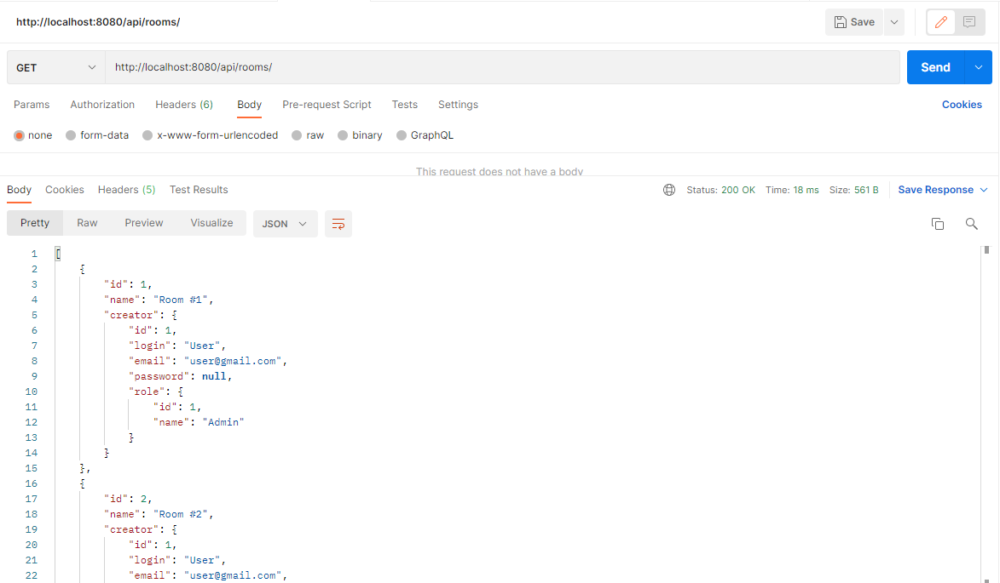
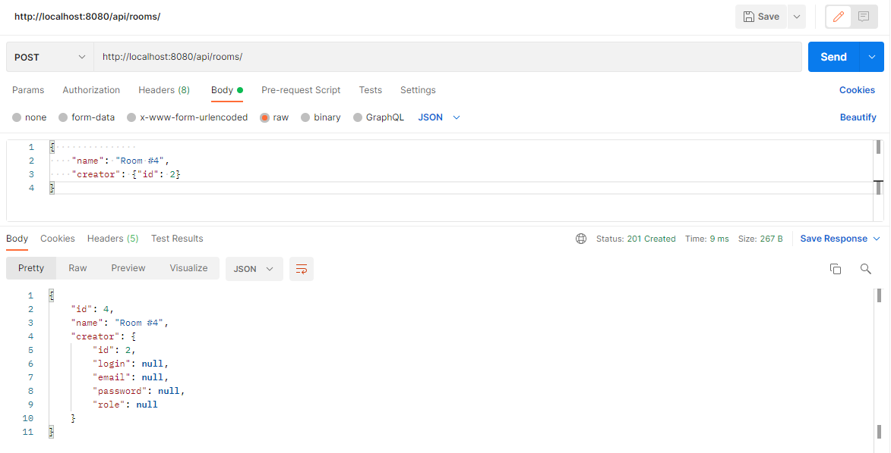
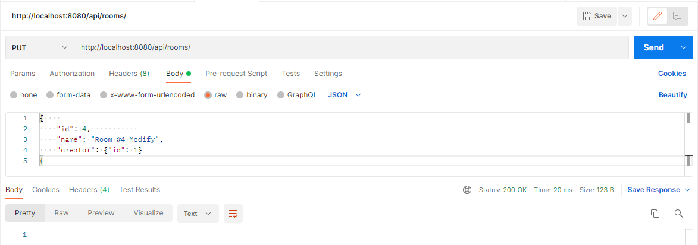
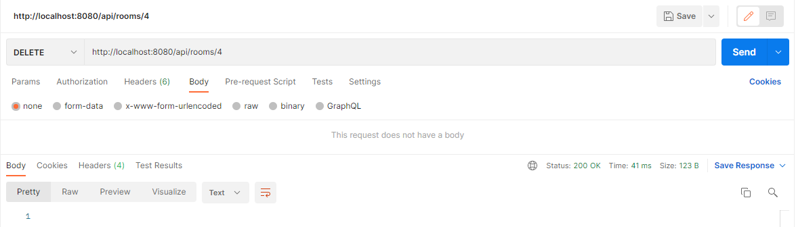
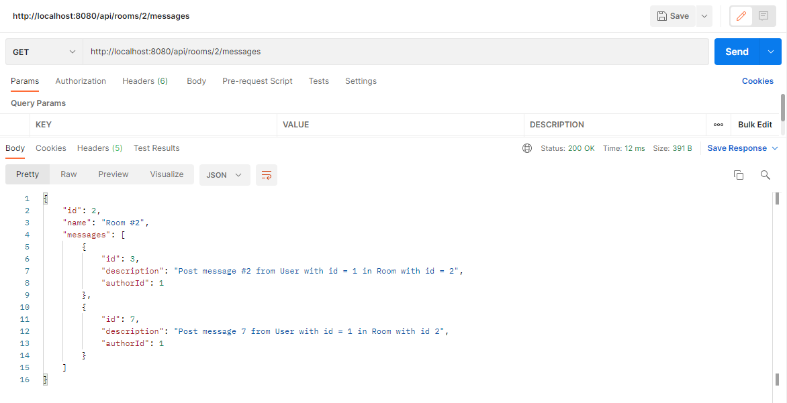
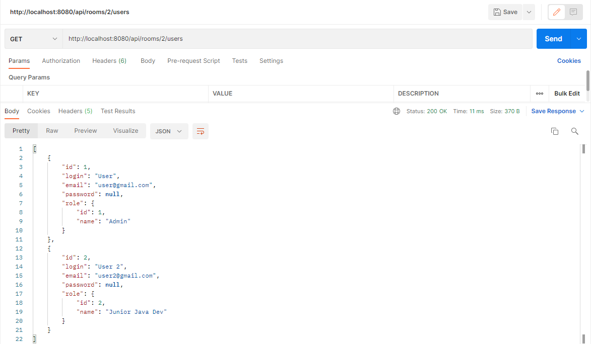
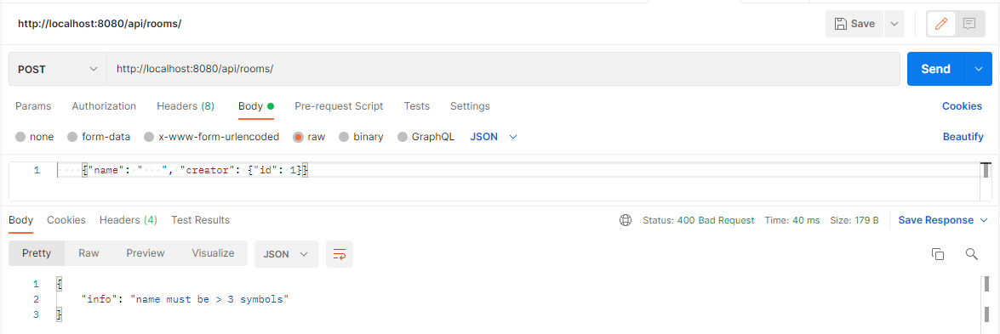

### Chat Rest API 
### Используемый стек: (Spring Boot, Spring Data Jpa, Hibernate, Hibernate Validator, PostgreSQL, Maven)

### Проект представляет собой эмуляцию Rest API функционала чата с комнатами.

#### Вся функциональность выстроена вокруг основных сущностей: Роль, Пользователь, Комната, Сообщение.

#### После старта проекта, чат позволяет отправлять JSON сообщения в комнатах от имени различных пользователей, обладающих определенными ролями.

#### Для начала работы необходимо создать Роль и назначить эту роль Пользователю при его регистрации, далее необходимо создать Комнату (одну или несколько), указав создателя и можно отправлять сообщения.
****
#### Последовательность действий:
1. Создание Роли.
Необходимо отправить POST-запрос по адресу `http://localhost:8080/api/roles/`, в теле указать
   JSON-строку `{"name": "Admin"}`. Ответное сообщение будет примерно таким `{"id": 1,"name": "Admin"}`.
   
2. Регистрация Пользователя.
Отправить POST-запрос `http://localhost:8080/api/persons/`, в теле указать JSON-строку 
   `{           
   "login": "User",
   "password": "password",
   "email": "user@gmail.com",
   "role": {"id": 1}
   }`. В качестве role id необходимо указать id из шага 1 или любой другой id уже созданной роли.
3. Создание Комнаты. 
   Отправить POST-запрос `http://localhost:8080/api/rooms/`, в теле указать JSON-строку
   `{"name": "Room #1", "creator": {"id": 1}}`. В качестве id creator используется id Person из второго шага
   или любой другой id уже созданного пользователя.
   
4. Отправка сообщения.
Сообщение можно публиковать в любой из Комнат от имени любого Пользователя.
   Отправить POST-запрос `http://localhost:8080/api/messages/`, в теле указать JSON-строку
   `{"description": "Post message #1 from User with id = 1 in Room with id = 1",        
   "room": {"id": 1},
   "author": {"id": 1}}`. В данном случае публикация сообщения происходит в комнате с id = 1 и от
   имени пользователя id которого 1.
   
Все JSON-ответы перечисленных операций можно увидеть на прикрепленных скриншотах ниже в разделе "Первоначальное заполнение".

****

#### Первоначальное заполнение:

****

#### Как пользоваться:
Примеры GET, POST, PUT, DELETE запросов будут приведены на примере Комнаты как самой нагруженной сущности.
Подобные операции с другими сущностями проводятся аналогично. Естественно формат JSON-ответов отличается
от формата JSON-запроса, т.к. для ответа используются DTO-модели, мапперы и формат регламентируется ими.

1. GET-запрос вернет следующее. Здесь выводится детальная информация по каждой из комнат.
   По адресу `http://localhost:8080/api/rooms/1` вернется JSON по первой комнате.
   

2. POST-запрос и ответ. Создание комнаты, владельцем которой будет Пользователь с id = 2.
   

3. PUT-запрос. Изменение названия комнаты и владельца. В качестве ответа JSON не передается,
   возвращается только статус.
   

4. DELETE-запрос. В адресной строке указывается id для удаления соответствующей комнаты.
   Удаление будет успешным только в случае отсутствия сообщений в комнате.
   

5. В отличие от других сущностей в Комнате можно посмотреть все сообщения написанные в ней и пользователей
   которые когда-либо писали сообщения:
   
      
   
6. Для каждой сущности происходит проверка критически важных полей и в таком же формате 
   выбрасываются любые другие исключения.
   

Форматы REST ответов не были регламентированы, поэтому они могут отличаться в зависимости
от обрабатываемых сущностей и используемой DTO-модели.
****
### Запуск собранного jar
java -jar target/name.jar